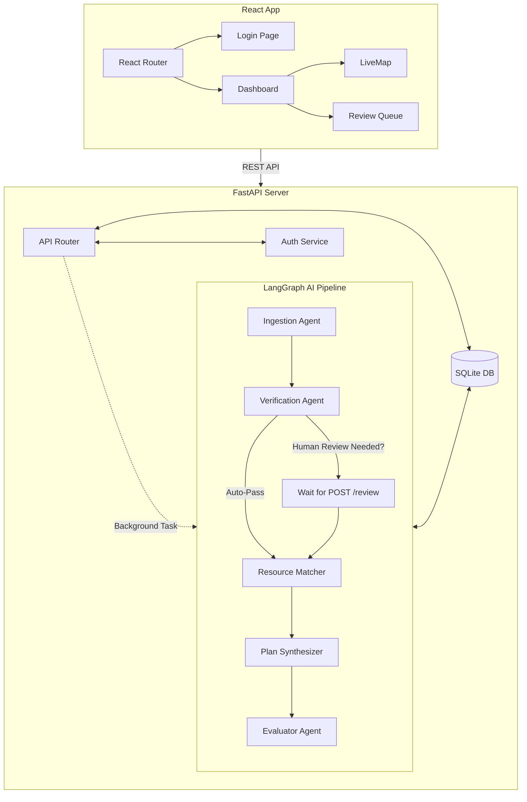
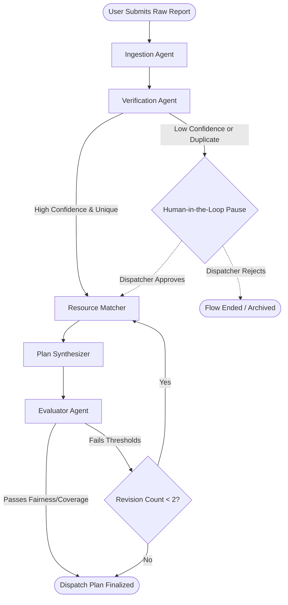

# FastAPI + React Emergency Dispatcher

A multi-agent AI system that triages emergency reports, matches resources, and generates dispatch plans using LangGraph, FastAPI, and React. 

This project aims to automate emergency resource dispatching by converting chaotic, unstructured disaster reports into verified, mathematically matched deployment plans, while maintaining a strict "Human-in-the-Loop" checkpoint for safety and oversight.

## High-Level System Architecture

The system employs a decoupled architecture consisting of a React frontend, a FastAPI backend, and an asynchronous LangGraph-powered AI pipeline.



### Architectural Positives
- **Decoupling via Background Tasks:** The HTTP request `POST /reports` returns immediately while the graph runs in the background, preventing timeouts.
- **Graph-based Orchestration:** Using LangGraph for the pipeline enables complex state management, cyclical logic (revisions), and human-in-the-loop pauses.
- **Optimistic UI:** The frontend leverages optimistic updates in the Review Queue for a snappier user experience.

## 🧠 LangGraph AI Pipeline Architecture

The intelligence of the system is distributed across five specialized agents, orchestrated by LangGraph. Below is the state machine flow showing how a raw message travels through the system.



## 📝 Example: How a Message Breaks Down

Here is an example of what happens at each layer of the pipeline when a chaotic message is received.

### 1. Raw Input (From SMS/Social Media)
> *"URGENT: We have about 50 people trapped at the community center on 5th street and we are completely out of water. Please send help quickly!"*

### 2. Ingestion Agent
Extracts the messy text into a structured data contract.
```json
{
  "location_text": "community center on 5th street",
  "need_type": "water",
  "quantity_estimate": 50,
  "stated_urgency": "critical",
  "extraction_confidence": 0.95
}
```

### 3. Verification Agent
Checks against past reports using embeddings to prevent duplicate dispatches, assigns an internal confidence score, and flags for review if necessary.
```json
{
  "need_id": "need-7a98b2",
  "verification_confidence": 0.92,
  "requires_human_review": false, 
  "duplicate_of": null
}
```
*(If `requires_human_review` was true, the pipeline would halt here and wait for the dashboard dispatcher).*

### 4. Resource Matcher
Queries the database (e.g., SQLite) for available "water" inventory and calculates distances.
```json
{
  "allocations": [
    {
      "resource_id": "res-water-wh1",
      "quantity_allocated": 50,
      "distance_km": 3.2,
      "allocation_method": "greedy_distance"
    }
  ]
}
```

### 5. Plan Synthesizer
Turns the raw allocation data back into a human-readable narrative for the dispatchers and logisticians.
> *"Deploying 50 units of Water from Warehouse 1 (res-water-wh1) to the community center on 5th street to address critical shortage. Estimated travel distance is 3.2km."*

### 6. Evaluator Agent
Acts as an internal critic. Scores the plan.
```json
{
  "coverage_pct": 100.0,
  "critical_unmet_count": 0,
  "fairness_score": 0.9,
  "passed": true,
  "rationale": "Plan successfully covers 100% of the critical water need with the closest available resource."
}
```

## 🚀 Getting Started

### Prerequisites
- Python 3.11+
- Node.js 18+
- [LM Studio](https://lmstudio.ai/) running a local model (e.g., `smollm3-3b`) on port `1234`.

### Backend Setup
1. Clone the repository and navigate to the root directory.
2. Create a virtual environment and install dependencies:
   ```bash
   python -m venv .venv
   .venv\Scripts\activate  # Windows
   pip install -r requirements.txt
   ```
3. Start the FastAPI server:
   ```bash
   uvicorn backend.main:app --reload
   ```
   *The API will be available at `http://127.0.0.1:8000`*

### Frontend Setup
1. Navigate to the frontend directory:
   ```bash
   cd frontend
   ```
2. Install dependencies:
   ```bash
   npm install
   ```
3. Start the Vite development server:
   ```bash
   npm run dev
   ```
   *The Dashboard will be available at `http://localhost:5173`*
